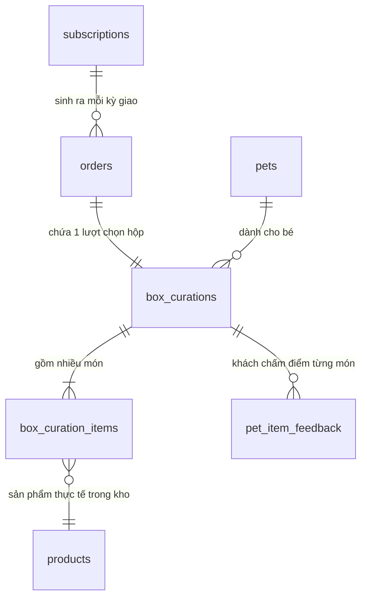

# KẾ HOẠCH TRIỂN KHAI DỰ ÁN FPETS

Tài liệu này đóng vai trò là bản kiến trúc kỹ thuật và kế hoạch thực thi chi tiết cho website FPETS (Bán Mystery Box và phụ kiện cho thú cưng), bám sát đặc tả tại [SPEC.md](file:///d:/pjFpets/docs/SPEC.md) và các quy ước tại [AGENTS.md](file:///d:/pjFpets/AGENTS.md). Kế hoạch đã được chốt toàn bộ các quyết định thiết kế và sẵn sàng thực thi.

---

## 1. Cấu trúc thư mục dự án Next.js (App Router)

Dự án sử dụng **Next.js (App Router) + TypeScript + Tailwind CSS**. Cấu trúc thư mục được phân tách rõ ràng thành Route Groups: nhóm Khách hàng vãng lai `(shop)`, nhóm Khách hàng đăng nhập `(account)`, và nhóm Quản trị nội bộ `(admin)`.

```text
fpets/
├── .env.example
├── .env.local (chỉ dùng local, không commit)
├── AGENTS.md
├── docs/
│   ├── SPEC.md
│   └── PLAN.md
├── supabase/
│   ├── migrations/
│   │   ├── 20260922000001_initial_schema.sql
│   │   ├── 20260922000002_rls_policies.sql
│   │   ├── 20260922000003_functions_and_triggers.sql
│   │   └── 20260922000004_seed_data.sql
│   └── seed.sql
├── public/
│   ├── images/
│   │   ├── hero/
│   │   ├── boxes/
│   │   └── products/
│   └── icons/
├── src/
│   ├── app/
│   │   ├── layout.tsx                     # Root layout (Font, Theme, Toast, Global Providers)
│   │   ├── not-found.tsx                  # 404 page
│   │   ├── error.tsx                      # Global error handling
│   │   │
│   │   ├── (auth)/                        # Nhóm Authentication (độc lập layout shop)
│   │   │   ├── login/page.tsx
│   │   │   ├── register/page.tsx
│   │   │   ├── forgot-password/page.tsx
│   │   │   └── callback/route.ts          # Auth exchange code callback từ Supabase
│   │   │
│   │   ├── (shop)/                        # Nhóm Khách hàng & Cửa hàng công khai
│   │   │   ├── layout.tsx                 # Header shop, Mobile Nav bar, Footer, Floating Support
│   │   │   ├── page.tsx                   # Trang chủ (Hero, Cách hoạt động, Bảng giá, Testimonials)
│   │   │   ├── boxes/
│   │   │   │   ├── page.tsx               # Danh sách Mystery Box & Gói subscription
│   │   │   │   └── [slug]/page.tsx        # Chi tiết loại Box (Tiêu chuẩn / Premium)
│   │   │   ├── shop/
│   │   │   │   ├── page.tsx               # Cửa hàng bán lẻ (Food, Toy, Accessory kèm Filter)
│   │   │   │   └── [slug]/page.tsx        # Chi tiết sản phẩm lẻ kèm Reviews
│   │   │   ├── quiz/
│   │   │   │   └── page.tsx               # Pet Quiz 5 câu hỏi thông minh
│   │   │   ├── cart/
│   │   │   │   └── page.tsx               # Giỏ hàng mua 1 lần (gắn Pet với Box, voucher, upsell)
│   │   │   ├── checkout/
│   │   │   │   ├── page.tsx               # Checkout mua 1 lần (4 khối) & Checkout gói định kỳ
│   │   │   │   └── result/page.tsx        # Kết quả thanh toán (Thành công / Thất bại, mã đơn)
│   │   │   ├── order-tracking/
│   │   │   │   └── page.tsx               # Tra cứu đơn khách vãng lai (Mã đơn + SĐT)
│   │   │   ├── about/page.tsx             # Về chúng tôi
│   │   │   ├── faq/page.tsx               # Câu hỏi thường gặp
│   │   │   └── contact/page.tsx           # Liên hệ (Zalo, Hotline, Messenger)
│   │   │
│   │   ├── (account)/                     # Nhóm Tài khoản khách hàng (bắt buộc đăng nhập)
│   │   │   ├── layout.tsx                 # Layout Sidebar tài khoản (desktop) + Tabbar (mobile)
│   │   │   └── my-account/
│   │   │       ├── profile/page.tsx       # Thông tin cá nhân & Sổ địa chỉ giao hàng
│   │   │       ├── pets/
│   │   │       │   ├── page.tsx           # Danh sách Pet Profile & nút thêm pet
│   │   │       │   ├── new/page.tsx       # Tạo Pet Profile mới
│   │   │       │   └── [id]/page.tsx      # Sửa Pet Profile, xem lịch sử hộp & feedback món
│   │   │       ├── orders/
│   │   │       │   ├── page.tsx           # Lịch sử đơn hàng (Tab: Tất cả, Chờ TT, Đang giao...)
│   │   │       │   └── [id]/page.tsx      # Chi tiết đơn, tracking timeline, nút Yêu cầu đổi/trả
│   │   │       ├── subscriptions/
│   │   │       │   ├── page.tsx           # Danh sách gói định kỳ
│   │   │       │   └── [id]/page.tsx      # Chi tiết gói: các kỳ, Pause 1-2 kỳ, Cancel, Gia hạn
│   │   │       ├── reviews/page.tsx       # Lịch sử đánh giá & voucher tích lũy
│   │   │       └── notifications/page.tsx # Trung tâm thông báo web
│   │   │
│   │   ├── (admin)/                       # Nhóm Quản trị Admin Dashboard
│   │   │   ├── layout.tsx                 # Admin Layout (Sidebar, Topbar, Phân quyền Role Guard)
│   │   │   └── admin/
│   │   │       ├── dashboard/page.tsx     # Báo cáo doanh thu, retention, cảnh báo hộp & tồn kho
│   │   │       ├── orders/
│   │   │       │   ├── page.tsx           # Quản lý đơn hàng (Lọc trạng thái, xác nhận COD)
│   │   │       │   └── [id]/page.tsx      # Chi tiết đơn, đổi trạng thái, gắn mã vận đơn, hủy/đổi trả
│   │   │       ├── box-curation/
│   │   │       │   ├── page.tsx           # Hàng chờ tuyển chọn Box theo đợt giao
│   │   │       │   └── [id]/page.tsx      # Màn hình tuyển chọn: gợi ý tự động, kiểm tra dị ứng, duyệt món
│   │   │       ├── subscriptions/
│   │   │       │   ├── page.tsx           # Danh sách subscription, tiến độ kỳ, cảnh báo quá hạn
│   │   │       │   └── [id]/page.tsx      # Chi tiết subscription, can thiệp pause/cancel/gia hạn hộ
│   │   │       ├── products/
│   │   │       │   ├── page.tsx           # Danh sách sản phẩm lẻ, toggle bán lẻ / dùng cho box
│   │   │       │   ├── new/page.tsx       # Thêm sản phẩm
│   │   │       │   └── [id]/page.tsx      # Chỉnh sửa sản phẩm, thuộc tính loài/size/thành phần
│   │   │       ├── box-types/page.tsx     # Quản lý loại Box & cấu hình giá/tỉ lệ giảm gói
│   │   │       ├── inventory/
│   │   │       │   ├── page.tsx           # Quản lý tồn kho, ngưỡng cảnh báo sắp hết
│   │   │       │   └── movements/page.tsx # Phiếu nhập kho, lịch sử xuất bán lẻ / xuất đóng box
│   │   │       ├── customers/
│   │   │       │   ├── page.tsx           # Danh sách khách hàng, khóa tài khoản
│   │   │       │   └── [id]/page.tsx      # Chi tiết khách: địa chỉ, đơn mua, thú cưng, subscription
│   │   │       ├── pets/page.tsx          # Danh sách tất cả Pet Profile hệ thống
│   │   │       ├── reviews/page.tsx       # Duyệt review, ẩn/hiện, trả lời phản hồi khách
│   │   │       ├── vouchers/page.tsx      # Tạo và quản lý mã voucher
│   │   │       └── staff/page.tsx         # Quản lý nhân viên & phân quyền (admin, kho, cskh)
│   │   │
│   │   └── api/                           # API Routes & Webhooks backend
│   │       ├── cron/
│   │       │   ├── cancel-expired-orders/route.ts  # Tự hủy đơn chờ thanh toán > 30 phút & hoàn trả tồn kho
│   │       │   ├── generate-sub-orders/route.ts    # Tạo đơn cho kỳ giao mới (trước cut-off 7 ngày)
│   │       │   ├── sub-reminders/route.ts          # Nhắc gia hạn trước 7, 3, 1 ngày
│   │       │   └── sub-status-check/route.ts       # Chuyển Quá hạn / Hết hạn sau 5 ngày
│   │       ├── payments/
│   │       │   ├── mock/                           # Mock Payment Gateway (dùng test trọn vẹn trước khi có sandbox thật)
│   │       │   │   ├── create/route.ts
│   │       │   │   └── ipn/route.ts
│   │       │   ├── momo/
│   │       │   │   ├── create/route.ts
│   │       │   │   └── ipn/route.ts                # Webhook IPN từ MoMo
│   │       │   └── vnpay/
│   │       │       ├── create/route.ts
│   │       │       └── ipn/route.ts                # Webhook IPN từ VNPay
│   │       └── webhooks/
│   │           └── supabase-auth/route.ts          # Đồng bộ auth.users -> public.profiles & gộp đơn cũ của khách vãng lai
│   │
│   ├── components/
│   │   ├── ui/                            # Primitives (Button, Modal, Input, Badge, Select, Tabs...)
│   │   ├── common/                        # Header, Footer, Breadcrumbs, EmptyState, Pagination
│   │   ├── shop/                          # ProductCard, BoxCard, FilterBar, PriceDisplay
│   │   ├── cart/                          # CartItemRow, CartSummary, VoucherInput
│   │   ├── checkout/                      # AddressSelector, PaymentMethodSelect, OrderReview
│   │   ├── quiz/                          # QuizStepCard, PetAttributeSelect, RecommendationBox
│   │   ├── account/                       # PetCard, OrderStatusTimeline, SubscriptionCycleProgress
│   │   └── admin/                         # StatsCard, DataTable, CurationItemPicker, AllergyWarningBadge
│   │
│   ├── lib/
│   │   ├── supabase/
│   │   │   ├── client.ts                  # Supabase client cho Browser
│   │   │   ├── server.ts                  # Supabase client cho Server Components / Actions
│   │   │   ├── admin.ts                   # Supabase service role client (bảo mật server-only)
│   │   │   └── middleware.ts              # Session refresh & Route protection
│   │   ├── payments/
│   │   │   ├── mock.ts                    # Xử lý giả lập Gateway Mock (MoMo/VNPay)
│   │   │   ├── momo.ts                    # Xử lý ký HMAC SHA256 MoMo
│   │   │   └── vnpay.ts                   # Xử lý ký HMAC SHA512 VNPay
│   │   ├── curation/
│   │   │   └── engine.ts                  # Thuật toán tự động đề xuất món cho Mystery Box
│   │   ├── email/
│   │   │   └── resend.ts                  # Gửi email giao dịch qua Resend (thông báo đơn, nhắc gia hạn)
│   │   ├── formatters.ts                  # Định dạng VND (299.000₫), ngày (dd/MM/yyyy)
│   │   └── constants.ts                   # Enums, trạng thái, cấu hình ship
│   │
│   ├── types/
│   │   ├── database.ts                    # Types sinh tự động từ Supabase Schema
│   │   ├── order.ts
│   │   ├── subscription.ts
│   │   └── curation.ts
│   │
│   └── middleware.ts                      # Next.js Edge Middleware (bảo vệ route /admin và /my-account)
```

---

## 2. Schema Database Supabase Đầy Đủ

### 2.1. Các Kiểu Dữ Liệu Enum

```sql
-- Vai trò người dùng
CREATE TYPE user_role AS ENUM ('customer', 'admin', 'kho', 'cskh');

-- 7 trạng thái đơn hàng theo chuẩn mục 7 của SPEC.md
CREATE TYPE order_status AS ENUM (
  'cho_thanh_toan',  -- Đã tạo đơn, chưa trả tiền online (tự hủy sau 30 phút và hoàn tồn kho)
  'da_xac_nhan',     -- Đã thanh toán hoặc COD đã được xác nhận
  'dang_chuan_bi',   -- Box đang được tuyển chọn / đóng gói
  'dang_giao',       -- Đã bàn giao đơn vị vận chuyển, có mã vận đơn
  'da_giao',         -- Khách đã nhận, mở quyền đánh giá review
  'da_huy',          -- Hủy bởi khách hoặc admin, hoàn tiền nếu đã trả
  'doi_tra'          -- Đang xử lý đổi / trả theo chính sách
);

-- 6 trạng thái Subscription theo chuẩn mục 5 của SPEC.md
CREATE TYPE subscription_status AS ENUM (
  'cho_thanh_toan',  -- Vừa đăng ký, chờ thanh toán tiền gói trả trước
  'dang_hoat_dong',  -- Đang hoạt động bình thường, giao định kỳ mỗi tháng
  'tam_dung',        -- Khách tạm dừng (pause 1 hoặc 2 kỳ)
  'qua_han',         -- Hết số hộp trả trước, chưa thanh toán gia hạn (giữ ưu đãi 5 ngày)
  'het_han',         -- Quá 5 ngày chưa gia hạn, ngừng giao
  'da_huy'           -- Khách chủ động hủy gói, vẫn giao hết các hộp đã trả trước
);

-- Đợt giao hàng định kỳ trong tháng
CREATE TYPE delivery_schedule AS ENUM ('dau_thang', 'giua_thang'); -- ngày 1-5 hoặc 15-20

-- Phương thức thanh toán
CREATE TYPE payment_method AS ENUM ('momo', 'vnpay', 'cod');

-- Trạng thái thanh toán
CREATE TYPE payment_status AS ENUM ('pending', 'paid', 'failed', 'refunded');

-- Thuộc tính thú cưng
CREATE TYPE pet_species AS ENUM ('dog', 'cat');
CREATE TYPE pet_size AS ENUM ('small', 'large'); -- nhỏ < 10kg, lớn >= 10kg
CREATE TYPE pet_age_group AS ENUM ('puppy_kitten', 'adult', 'senior');

-- Đánh giá món trong box của bé
CREATE TYPE item_feedback_rating AS ENUM ('like', 'neutral', 'dislike');

-- Loại biến động kho
CREATE TYPE inventory_movement_type AS ENUM (
  'import',          -- Nhập hàng từ nhà cung cấp
  'retail_sale',     -- Xuất bán lẻ qua giỏ hàng (hoặc tạm giữ khi đặt hàng)
  'box_curation',    -- Xuất đóng hộp Mystery Box
  'adjustment',      -- Kiểm kê điều chỉnh kho (hỏng, hao hụt)
  'return_restock'   -- Khách trả hàng hoặc đơn hết hạn thanh toán hoàn lại kho
);

-- Loại voucher
CREATE TYPE voucher_discount_type AS ENUM ('percentage', 'fixed_amount', 'free_shipping');
```

---

### 2.2. Danh Sách Các Bảng Chi Tiết

#### 1. `profiles`
Chứa thông tin người dùng mở rộng từ `auth.users`, bao gồm phân quyền vai trò.
- `id`: `uuid` PRIMARY KEY (REFERENCES `auth.users(id)` ON DELETE CASCADE)
- `email`: `text` NOT NULL
- `full_name`: `text`
- `phone`: `text`
- `avatar_url`: `text`
- `role`: `user_role` NOT NULL DEFAULT 'customer'
- `is_active`: `boolean` NOT NULL DEFAULT true
- `created_at`: `timestamptz` NOT NULL DEFAULT now()
- `updated_at`: `timestamptz` NOT NULL DEFAULT now()

#### 2. `addresses`
Sổ địa chỉ nhận hàng của khách.
- `id`: `uuid` PRIMARY KEY DEFAULT gen_random_uuid()
- `user_id`: `uuid` NOT NULL REFERENCES `profiles(id)` ON DELETE CASCADE
- `recipient_name`: `text` NOT NULL
- `phone`: `text` NOT NULL
- `province_city`: `text` NOT NULL
- `district`: `text` NOT NULL
- `ward`: `text` NOT NULL
- `street_address`: `text` NOT NULL
- `is_default`: `boolean` NOT NULL DEFAULT false
- `created_at`: `timestamptz` NOT NULL DEFAULT now()

#### 3. `pets`
Hồ sơ thú cưng (Pet Profile).
- `id`: `uuid` PRIMARY KEY DEFAULT gen_random_uuid()
- `user_id`: `uuid` NOT NULL REFERENCES `profiles(id)` ON DELETE CASCADE
- `name`: `text` NOT NULL
- `species`: `pet_species` NOT NULL
- `breed`: `text`
- `weight`: `numeric(5,2)`
- `size`: `pet_size` NOT NULL
- `age_group`: `pet_age_group` NOT NULL
- `birthdate`: `date`
- `gender`: `text`
- `avatar_url`: `text`
- `allergies`: `text[]` DEFAULT '{}'::text[] -- Danh sách thành phần dị ứng
- `preferences`: `text[]` DEFAULT '{}'::text[] -- Sở thích (gặm, phát tiếng, vận động...)
- `notes`: `text`
- `created_at`: `timestamptz` NOT NULL DEFAULT now()
- `updated_at`: `timestamptz` NOT NULL DEFAULT now()

#### 4. `categories`
Danh mục sản phẩm bán lẻ (Đồ ăn, đồ chơi, phụ kiện...).
- `id`: `uuid` PRIMARY KEY DEFAULT gen_random_uuid()
- `name`: `text` NOT NULL
- `slug`: `text` NOT NULL UNIQUE
- `description`: `text`
- `parent_id`: `uuid` REFERENCES `categories(id)` ON DELETE SET NULL
- `created_at`: `timestamptz` NOT NULL DEFAULT now()

#### 5. `products`
Sản phẩm lẻ trong kho và sản phẩm ứng viên để chọn vào Mystery Box.
- `id`: `uuid` PRIMARY KEY DEFAULT gen_random_uuid()
- `category_id`: `uuid` REFERENCES `categories(id)` ON DELETE SET NULL
- `name`: `text` NOT NULL
- `slug`: `text` NOT NULL UNIQUE
- `description`: `text`
- `price`: `numeric(12,0)` NOT NULL -- Giá bán lẻ niêm yết (VND)
- `original_price`: `numeric(12,0)`
- `stock_quantity`: `integer` NOT NULL DEFAULT 0 -- Tồn kho khả dụng (đã trừ đơn đang giữ 30p)
- `low_stock_threshold`: `integer` NOT NULL DEFAULT 5
- `species`: `text` NOT NULL DEFAULT 'both' -- 'dog', 'cat', 'both'
- `target_size`: `text` NOT NULL DEFAULT 'all' -- 'small', 'large', 'all'
- `target_age`: `text` NOT NULL DEFAULT 'all' -- 'puppy_kitten', 'adult', 'senior', 'all'
- `ingredients`: `text[]` DEFAULT '{}'::text[] -- Thành phần để quét kiểm tra dị ứng
- `images`: `text[]` DEFAULT '{}'::text[]
- `is_retail`: `boolean` NOT NULL DEFAULT true -- Có bán lẻ trên shop không
- `is_box_item`: `boolean` NOT NULL DEFAULT true -- Có được dùng để nhặt vào Box không
- `is_active`: `boolean` NOT NULL DEFAULT true
- `created_at`: `timestamptz` NOT NULL DEFAULT now()
- `updated_at`: `timestamptz` NOT NULL DEFAULT now()

#### 6. `box_types`
Định nghĩa loại Mystery Box (Tiêu chuẩn / Premium cho từng size/loài).
- `id`: `uuid` PRIMARY KEY DEFAULT gen_random_uuid()
- `name`: `text` NOT NULL -- Ví dụ: "Box Tiêu chuẩn - Chó nhỏ"
- `slug`: `text` NOT NULL UNIQUE
- `species`: `pet_species` NOT NULL
- `size`: `pet_size` NOT NULL
- `item_count_min`: `integer` NOT NULL -- 4 (tiêu chuẩn) hoặc 6 (premium)
- `item_count_max`: `integer` NOT NULL -- 5 (tiêu chuẩn) hoặc 7 (premium)
- `min_retail_value`: `numeric(12,0)` NOT NULL -- 380.000₫ hoặc 650.000₫
- `base_price`: `numeric(12,0)` NOT NULL -- 299.000₫ hoặc 499.000₫
- `description`: `text`
- `images`: `text[]` DEFAULT '{}'::text[]
- `is_active`: `boolean` NOT NULL DEFAULT true
- `created_at`: `timestamptz` NOT NULL DEFAULT now()

#### 7. `subscription_plans`
Cấu hình gói định kỳ 1, 3, 6 hộp.
- `id`: `uuid` PRIMARY KEY DEFAULT gen_random_uuid()
- `name`: `text` NOT NULL -- "Gói 1 hộp", "Gói 3 hộp", "Gói 6 hộp"
- `cycle_count`: `integer` NOT NULL UNIQUE -- 1, 3, 6
- `discount_percentage`: `numeric(5,2)` NOT NULL -- 0.00, 10.00, 15.00
- `free_shipping`: `boolean` NOT NULL DEFAULT false -- Gói 3 và 6 được freeship
- `birthday_gift`: `boolean` NOT NULL DEFAULT false -- Gói 6 có quà sinh nhật
- `is_active`: `boolean` NOT NULL DEFAULT true

#### 8. `carts`
Giỏ hàng (lưu cho user hoặc session khách vãng lai).
- `id`: `uuid` PRIMARY KEY DEFAULT gen_random_uuid()
- `user_id`: `uuid` REFERENCES `profiles(id)` ON DELETE CASCADE
- `session_id`: `text` -- Dành cho khách chưa đăng nhập
- `created_at`: `timestamptz` NOT NULL DEFAULT now()
- `updated_at`: `timestamptz` NOT NULL DEFAULT now()

#### 9. `cart_items`
Chi tiết món trong giỏ hàng (chỉ chứa đơn mua 1 lần).
- `id`: `uuid` PRIMARY KEY DEFAULT gen_random_uuid()
- `cart_id`: `uuid` NOT NULL REFERENCES `carts(id)` ON DELETE CASCADE
- `product_id`: `uuid` REFERENCES `products(id)` ON DELETE CASCADE
- `box_type_id`: `uuid` REFERENCES `box_types(id)` ON DELETE CASCADE
- `pet_id`: `uuid` REFERENCES `pets(id)` ON DELETE CASCADE -- Đã sửa sang CASCADE để tránh lỗi CHECK constraint khi xóa thú cưng
- `quantity`: `integer` NOT NULL DEFAULT 1 CHECK (quantity > 0 AND quantity <= 10)
- `created_at`: `timestamptz` NOT NULL DEFAULT now()
- `updated_at`: `timestamptz` NOT NULL DEFAULT now()
- CONSTRAINT `cart_item_target_check` CHECK (
    (product_id IS NOT NULL AND box_type_id IS NULL) OR
    (product_id IS NULL AND box_type_id IS NOT NULL AND pet_id IS NOT NULL)
  )

#### 10. `vouchers`
Mã giảm giá và khuyến mãi.
- `id`: `uuid` PRIMARY KEY DEFAULT gen_random_uuid()
- `code`: `text` NOT NULL UNIQUE
- `voucher_type`: `voucher_discount_type` NOT NULL
- `discount_value`: `numeric(12,0)` NOT NULL -- Số tiền VND hoặc số %
- `min_order_value`: `numeric(12,0)` NOT NULL DEFAULT 0
- `max_discount`: `numeric(12,0)` -- Áp dụng với voucher %
- `usage_limit_total`: `integer` NOT NULL DEFAULT 100
- `usage_limit_per_user`: `integer` NOT NULL DEFAULT 1
- `used_count`: `integer` NOT NULL DEFAULT 0
- `valid_from`: `timestamptz` NOT NULL
- `valid_to`: `timestamptz` NOT NULL
- `scope`: `text` NOT NULL DEFAULT 'all' -- 'retail', 'box', 'first_subscription', 'all'
- `is_active`: `boolean` NOT NULL DEFAULT true
- `created_at`: `timestamptz` NOT NULL DEFAULT now()

#### 11. `subscriptions`
Bản ghi hợp đồng gói định kỳ trả trước.
- `id`: `uuid` PRIMARY KEY DEFAULT gen_random_uuid()
- `subscription_code`: `text` NOT NULL UNIQUE -- Mã gói ví dụ: SUB-2026-XXXX
- `user_id`: `uuid` NOT NULL REFERENCES `profiles(id)` ON DELETE RESTRICT
- `pet_id`: `uuid` NOT NULL REFERENCES `pets(id)` ON DELETE RESTRICT
- `box_type_id`: `uuid` NOT NULL REFERENCES `box_types(id)` ON DELETE RESTRICT
- `plan_id`: `uuid` NOT NULL REFERENCES `subscription_plans(id)` ON DELETE RESTRICT
- `total_cycles`: `integer` NOT NULL -- 1, 3, hoặc 6
- `remaining_cycles`: `integer` NOT NULL -- Số hộp còn lại chưa giao
- `current_cycle`: `integer` NOT NULL DEFAULT 1 -- Đang ở kỳ thứ mấy
- `status`: `subscription_status` NOT NULL DEFAULT 'cho_thanh_toan' -- Thuộc đúng 6 trạng thái chuẩn
- `delivery_schedule`: `delivery_schedule` NOT NULL -- 'dau_thang' hoặc 'giua_thang'
- `shipping_address_id`: `uuid` REFERENCES `addresses(id)` ON DELETE RESTRICT
- `shipping_address_snapshot`: `jsonb` NOT NULL -- Snapshot địa chỉ
- `total_prepaid_amount`: `numeric(12,0)` NOT NULL -- Tổng tiền trả trước toàn gói
- `next_delivery_date`: `date` NOT NULL -- Dự kiến ngày giao kỳ kế tiếp (tự động nối tiếp khi gia hạn)
- `cutoff_date`: `date` NOT NULL -- Ngày chốt kỳ (trước ngày giao 7 ngày)
- `paused_cycles_left`: `integer` NOT NULL DEFAULT 0 -- Số kỳ còn lại đang tạm dừng (tối đa 2)
- `grace_period_expires_at`: `timestamptz` -- Hạn cuối 5 ngày ân hạn khi rơi vào 'qua_han'
- `cancellation_reason`: `text`
- `created_at`: `timestamptz` NOT NULL DEFAULT now()
- `updated_at`: `timestamptz` NOT NULL DEFAULT now()

#### 12. `orders`
Đơn hàng (bao gồm đơn mua 1 lần và đơn từng kỳ của subscription).
- `id`: `uuid` PRIMARY KEY DEFAULT gen_random_uuid()
- `order_code`: `text` NOT NULL UNIQUE -- FPET-YYYYMMDD-XXXX
- `user_id`: `uuid` REFERENCES `profiles(id)` ON DELETE SET NULL -- NULL nếu là khách mua lẻ vãng lai (sẽ tự gộp khi khách đăng ký)
- `order_type`: `text` NOT NULL -- 'retail', 'mystery_box', 'subscription_initial', 'subscription_cycle'
- `subscription_id`: `uuid` REFERENCES `subscriptions(id)` ON DELETE SET NULL
- `cycle_index`: `integer` -- Ví dụ kỳ 2 (hiển thị nhãn "Kỳ 2/6")
- `status`: `order_status` NOT NULL DEFAULT 'cho_thanh_toan'
- `payment_method`: `payment_method` NOT NULL
- `payment_status`: `payment_status` NOT NULL DEFAULT 'pending'
- `subtotal`: `numeric(12,0)` NOT NULL
- `shipping_fee`: `numeric(12,0)` NOT NULL DEFAULT 0
- `discount_amount`: `numeric(12,0)` NOT NULL DEFAULT 0
- `total_amount`: `numeric(12,0)` NOT NULL -- Với 'subscription_cycle' thì = 0 do đã thanh toán trước ở subscription_initial
- `voucher_id`: `uuid` REFERENCES `vouchers(id)` ON DELETE SET NULL
- `recipient_name`: `text` NOT NULL
- `recipient_phone`: `text` NOT NULL
- `shipping_address`: `text` NOT NULL
- `province_city`: `text` NOT NULL
- `district`: `text` NOT NULL
- `ward`: `text` NOT NULL
- `customer_notes`: `text`
- `admin_notes`: `text`
- `tracking_code`: `text` -- Mã vận đơn giao hàng
- `payment_expires_at`: `timestamptz` -- Hạn chót thanh toán (now + 30 phút). Quá hạn tự hủy và hoàn tồn kho
- `paid_at`: `timestamptz`
- `cancelled_at`: `timestamptz`
- `cancellation_reason`: `text`
- `return_requested_at`: `timestamptz`
- `return_reason`: `text`
- `created_at`: `timestamptz` NOT NULL DEFAULT now()
- `updated_at`: `timestamptz` NOT NULL DEFAULT now()

#### 13. `order_items`
Chi tiết món trong đơn hàng.
- `id`: `uuid` PRIMARY KEY DEFAULT gen_random_uuid()
- `order_id`: `uuid` NOT NULL REFERENCES `orders(id)` ON DELETE CASCADE
- `product_id`: `uuid` REFERENCES `products(id)` ON DELETE SET NULL
- `box_type_id`: `uuid` REFERENCES `box_types(id)` ON DELETE SET NULL
- `pet_id`: `uuid` REFERENCES `pets(id)` ON DELETE SET NULL
- `product_name_snapshot`: `text` NOT NULL
- `unit_price`: `numeric(12,0)` NOT NULL
- `quantity`: `integer` NOT NULL DEFAULT 1
- `total_price`: `numeric(12,0)` NOT NULL

#### 14. `box_curations`
Bản ghi hàng chờ tuyển chọn Box (1 đơn box = 1 box_curation).
- `id`: `uuid` PRIMARY KEY DEFAULT gen_random_uuid()
- `order_id`: `uuid` NOT NULL UNIQUE REFERENCES `orders(id)` ON DELETE CASCADE
- `pet_id`: `uuid` NOT NULL REFERENCES `pets(id)` ON DELETE RESTRICT
- `box_type_id`: `uuid` NOT NULL REFERENCES `box_types(id)` ON DELETE RESTRICT
- `status`: `text` NOT NULL DEFAULT 'pending_curation' -- 'pending_curation', 'curated', 'packed'
- `curated_by`: `uuid` REFERENCES `profiles(id)` ON DELETE SET NULL -- Nhân viên kho/admin tuyển chọn
- `total_retail_value`: `numeric(12,0)` NOT NULL DEFAULT 0 -- Tổng giá trị các món chọn được
- `notes`: `text`
- `created_at`: `timestamptz` NOT NULL DEFAULT now()
- `curated_at`: `timestamptz`

#### 15. `box_curation_items`
Các sản phẩm cụ thể được nhặt vào hộp.
- `id`: `uuid` PRIMARY KEY DEFAULT gen_random_uuid()
- `box_curation_id`: `uuid` NOT NULL REFERENCES `box_curations(id)` ON DELETE CASCADE
- `product_id`: `uuid` NOT NULL REFERENCES `products(id)` ON DELETE RESTRICT
- `quantity`: `integer` NOT NULL DEFAULT 1
- `retail_price`: `numeric(12,0)` NOT NULL -- Giá trị niêm yết tại thời điểm chọn
- `created_at`: `timestamptz` NOT NULL DEFAULT now()

#### 16. `pet_item_feedback`
Phản hồi chi tiết của thú cưng cho từng món trong Box.
- `id`: `uuid` PRIMARY KEY DEFAULT gen_random_uuid()
- `pet_id`: `uuid` NOT NULL REFERENCES `pets(id)` ON DELETE CASCADE
- `product_id`: `uuid` NOT NULL REFERENCES `products(id)` ON DELETE CASCADE
- `box_curation_id`: `uuid` REFERENCES `box_curations(id)` ON DELETE CASCADE
- `rating`: `item_feedback_rating` NOT NULL -- 'like' (thích), 'neutral' (bình thường), 'dislike' (không thích)
- `notes`: `text`
- `created_at`: `timestamptz` NOT NULL DEFAULT now()
- CONSTRAINT `unique_pet_product_curation` UNIQUE (pet_id, product_id, box_curation_id)

#### 17. `inventory_movements`
Nhật ký biến động tồn kho chi tiết.
- `id`: `uuid` PRIMARY KEY DEFAULT gen_random_uuid()
- `product_id`: `uuid` NOT NULL REFERENCES `products(id)` ON DELETE RESTRICT
- `movement_type`: `inventory_movement_type` NOT NULL
- `quantity`: `integer` NOT NULL -- Dương khi nhập/hoàn trả, âm khi xuất bán/đóng hộp
- `previous_stock`: `integer` NOT NULL
- `new_stock`: `integer` NOT NULL
- `reference_id`: `text` -- Mã đơn order_code hoặc mã curation
- `note`: `text`
- `performed_by`: `uuid` REFERENCES `profiles(id)` ON DELETE SET NULL
- `created_at`: `timestamptz` NOT NULL DEFAULT now()

#### 18. `voucher_usages`
Lịch sử dùng voucher (để kiểm tra giới hạn mỗi khách 1 lần).
- `id`: `uuid` PRIMARY KEY DEFAULT gen_random_uuid()
- `voucher_id`: `uuid` NOT NULL REFERENCES `vouchers(id)` ON DELETE CASCADE
- `user_id`: `uuid` REFERENCES `profiles(id)` ON DELETE CASCADE
- `order_id`: `uuid` NOT NULL REFERENCES `orders(id)` ON DELETE CASCADE
- `discount_amount`: `numeric(12,0)` NOT NULL
- `created_at`: `timestamptz` NOT NULL DEFAULT now()

#### 19. `reviews`
Đánh giá đơn hàng (1-5 sao kèm tối đa 5 ảnh).
- `id`: `uuid` PRIMARY KEY DEFAULT gen_random_uuid()
- `order_id`: `uuid` NOT NULL UNIQUE REFERENCES `orders(id)` ON DELETE CASCADE
- `user_id`: `uuid` NOT NULL REFERENCES `profiles(id)` ON DELETE CASCADE
- `rating`: `integer` NOT NULL CHECK (rating >= 1 AND rating <= 5)
- `comment`: `text`
- `images`: `text[]` DEFAULT '{}'::text[] -- Tối đa 5 ảnh unbox
- `is_rewarded`: `boolean` NOT NULL DEFAULT false -- Đã tặng voucher 20k cho review có ảnh chưa
- `status`: `text` NOT NULL DEFAULT 'published' -- 'published', 'hidden'
- `admin_reply`: `text`
- `admin_reply_at`: `timestamptz`
- `created_at`: `timestamptz` NOT NULL DEFAULT now()

#### 20. `notifications`
Thông báo trên web cho khách hàng.
- `id`: `uuid` PRIMARY KEY DEFAULT gen_random_uuid()
- `user_id`: `uuid` NOT NULL REFERENCES `profiles(id)` ON DELETE CASCADE
- `title`: `text` NOT NULL
- `message`: `text` NOT NULL
- `type`: `text` NOT NULL -- 'order', 'subscription', 'voucher', 'system'
- `link`: `text`
- `is_read`: `boolean` NOT NULL DEFAULT false
- `created_at`: `timestamptz` NOT NULL DEFAULT now()

---

### 2.3. Giải Thích Quan Hệ: `subscription` → Các kỳ → `order` → `box_curation` & Cơ Chế Gia Hạn

Mô hình liên kết này giải quyết trọn vẹn yêu cầu nghiệp vụ của FPETS:



1. **Khách hàng đăng ký gói định kỳ:**
   - Tạo một bản ghi trong `subscriptions` với `total_cycles` = 1, 3, hoặc 6.
   - Đồng thời sinh ra một đơn hàng ban đầu `orders` loại `subscription_initial` với `total_amount` bằng tiền trả trước của cả gói (ví dụ gói 3 hộp là 807.000₫). Khách thanh toán MoMo hoặc VNPay.
   - Khi thanh toán thành công, `subscriptions.status` chuyển sang `dang_hoat_dong`.
2. **Sinh đơn hàng cho từng kỳ (`orders`):**
   - Trước mỗi đợt giao (đầu tháng hoặc giữa tháng) 10-12 ngày (tức là trước ngày chốt cut-off 7 ngày), hệ thống cron tự động kiểm tra `subscriptions` đang hoạt động và sinh ra một `order` có `order_type = 'subscription_cycle'`.
   - Đơn hàng này có `subscription_id = subscriptions.id`, `cycle_index = 2` (nhãn hiển thị: "Kỳ 2/6"), `total_amount = 0` (vì tiền đã trả ở kỳ initial), và trạng thái mặc định là `da_xac_nhan`.
   - `subscriptions.remaining_cycles` giảm đi 1.
3. **Đưa vào hàng chờ tuyển chọn (`box_curations`):**
   - Ngay khi `orders` (loại `subscription_cycle` hoặc `mystery_box` mua lẻ) được tạo và xác nhận, hệ thống tự động insert một bản ghi vào `box_curations` gắn với `order_id` và `pet_id`.
   - Động cơ tuyển chọn (`curation engine`) tự động chạy để gợi ý các sản phẩm phù hợp:
     - Khớp loài (`dog`/`cat`), size (`small`/`large`), độ tuổi (`puppy_kitten`/`adult`/`senior`).
     - **Loại trừ** các sản phẩm có `ingredients` trùng với `pets.allergies`.
     - **Loại trừ** các sản phẩm đã từng gửi cho bé ở các kỳ trước (truy vấn qua các `box_curation_items` cũ của cùng `pet_id`).
     - **Loại trừ** các sản phẩm mà bé đã từng bị chấm `dislike` trong bảng `pet_item_feedback`.
     - Đảm bảo cơ cấu tối thiểu: ít nhất 1 đồ ăn, 1 đồ chơi, 1 phụ kiện/vệ sinh.
     - Đảm bảo tổng giá trị bán lẻ `total_retail_value` ≥ `min_retail_value` của loại box.
4. **Admin/Nhân viên kho duyệt & Trừ tồn kho:**
   - Nhân viên kho mở màn hình "Hàng chờ tuyển chọn box", xem gợi ý, có thể thay đổi món nếu cần.
   - Bấm "Xác nhận duyệt": hệ thống tạo các dòng trong `inventory_movements` (loại `box_curation`), trừ trực tiếp `stock_quantity` trong `products`, chuyển `box_curations.status = 'curated'` và chuyển `orders.status = 'dang_chuan_bi'`.
5. **Khách nhận hàng và tạo vòng lặp dữ liệu (`pet_item_feedback`):**
   - Khi đơn chuyển sang `da_giao`, khách hàng vào trang chi tiết đơn hoặc phần Review để đánh giá: chấm điểm từng món trong hộp (Thích / Bình thường / Không thích).
   - Dữ liệu này được ghi vào `pet_item_feedback`, trở thành bộ lọc dữ liệu chính xác cho lần tuyển chọn của kỳ tiếp theo!
6. **Cơ chế gia hạn gói khi ở kỳ cuối (Renewal Flow):**
   - Khi gói cũ còn đúng 1 kỳ (`remaining_cycles = 1`), hệ thống gửi thông báo nhắc gia hạn.
   - Khách bấm "Gia hạn" và thanh toán gói mới (ví dụ gói 6 hộp): Hệ thống tạo một bản ghi `subscriptions` mới thuộc 6 trạng thái chuẩn (`dang_hoat_dong` sau khi thanh toán).
   - `next_delivery_date` và `cutoff_date` của bản ghi mới tự động tính nối tiếp ngay sau kỳ giao cuối của gói cũ (tháng tiếp theo), đảm bảo không gián đoạn việc nhận box của bé mà vẫn giữ lịch sử hóa đơn độc lập rõ ràng.

---

## 3. Danh Sách Chính Sách Row Level Security (RLS) Cho Từng Bảng

Mọi bảng trong database đều được **bật RLS (`ALTER TABLE ... ENABLE ROW LEVEL SECURITY;`)**. Khách hàng chỉ được đọc/sửa dữ liệu của chính mình; các quyền quản trị được chia theo vai trò người dùng trong `profiles.role`.

### 3.1. Các Hàm Hỗ Trợ Phân Quyền (Tạo trong schema `public` để Supabase cấp quyền chuẩn)

```sql
-- Lấy role của user hiện tại
CREATE OR REPLACE FUNCTION public.get_user_role()
RETURNS user_role AS $$
  SELECT role FROM public.profiles WHERE id = auth.uid();
$$ LANGUAGE sql SECURITY DEFINER STABLE;

-- Kiểm tra có phải là Admin (Chủ shop)
CREATE OR REPLACE FUNCTION public.is_admin()
RETURNS boolean AS $$
  SELECT EXISTS (
    SELECT 1 FROM public.profiles
    WHERE id = auth.uid() AND role = 'admin' AND is_active = true
  );
$$ LANGUAGE sql SECURITY DEFINER STABLE;

-- Kiểm tra nhân viên nội bộ (Admin, Kho, CSKH)
CREATE OR REPLACE FUNCTION public.is_staff()
RETURNS boolean AS $$
  SELECT EXISTS (
    SELECT 1 FROM public.profiles
    WHERE id = auth.uid() AND role IN ('admin', 'kho', 'cskh') AND is_active = true
  );
$$ LANGUAGE sql SECURITY DEFINER STABLE;
```

---

### 3.2. Ma Trận Chính Sách RLS Từng Bảng

| Tên Bảng | Đối Tượng / Quyền | Chi Tiết Điều Kiện (USING / WITH CHECK) |
| :--- | :--- | :--- |
| **`profiles`** | Mọi người (Public) | Không được đọc danh sách full. |
| | Khách hàng (Customer) | SELECT: `id = auth.uid()`. UPDATE: `id = auth.uid()` (không được sửa cột `role`, `is_active`). |
| | Staff (Admin/CSKH) | SELECT: `public.is_staff() = true`. Admin (`public.is_admin() = true`) có toàn quyền UPDATE role, khóa tài khoản. |
| **`addresses`** | Khách hàng | Toàn quyền (SELECT, INSERT, UPDATE, DELETE) với địa chỉ của mình: `user_id = auth.uid()`. |
| | Staff CSKH / Admin | SELECT: `public.is_staff() = true` để phục vụ xử lý giao hàng. |
| **`pets`** | Khách hàng | Toàn quyền với thú cưng của mình: `user_id = auth.uid()`. |
| | Staff (Kho/CSKH/Admin)| SELECT: `public.is_staff() = true` để phục vụ tuyển chọn và hỗ trợ khách. UPDATE: CSKH/Admin sửa hộ theo yêu cầu khách. |
| **`categories`** | Mọi người (Anon/Public)| SELECT các danh mục công khai. |
| | Staff Admin/Kho | INSERT, UPDATE, DELETE danh mục: `public.is_staff() = true`. |
| **`products`** | Mọi người (Anon/Public)| SELECT với điều kiện `is_active = true`. |
| | Staff Kho / Admin | SELECT tất cả (kể cả sản phẩm ẩn), INSERT, UPDATE giá và tồn kho: `public.is_staff() = true`. |
| **`box_types`** | Mọi người (Anon/Public)| SELECT các loại box `is_active = true`. |
| | Staff Admin | Toàn quyền INSERT, UPDATE, DELETE cấu hình box: `public.is_admin() = true`. |
| **`subscription_plans`**| Mọi người | SELECT các gói `is_active = true`. Admin toàn quyền sửa: `public.is_admin() = true`. |
| **`carts` & `cart_items`**| Khách đăng nhập | Toàn quyền với giỏ hàng của mình: `carts.user_id = auth.uid()`. |
| | Khách vãng lai (Anon) | SELECT/UPDATE dựa trên cookie `session_id` thông qua API Server Route an toàn. |
| **`orders`** | Khách hàng | SELECT đơn của mình: `user_id = auth.uid()`. UPDATE: Chỉ được cập nhật trạng thái `da_huy` khi đơn đang ở trạng thái `cho_thanh_toan`. |
| | Khách vãng lai | SELECT thông qua Postgres RPC an toàn `lookup_order(order_code, phone)`. |
| | Staff CSKH / Kho / Admin | SELECT tất cả đơn: `public.is_staff() = true`. UPDATE trạng thái theo phân quyền (Kho: cập nhật `dang_chuan_bi`, `dang_giao`, gắn mã vận đơn; CSKH: xác nhận COD, xử lý `doi_tra`; Admin: hủy, hoàn tiền). |
| **`order_items`** | Khách hàng | SELECT các item thuộc đơn của mình (`order.user_id = auth.uid()`). |
| | Staff | SELECT tất cả item: `public.is_staff() = true`. |
| **`subscriptions`** | Khách hàng | SELECT gói của mình: `user_id = auth.uid()`. UPDATE: Chỉ được cập nhật Pause, Resume, Cancel theo đúng logic quy định. |
| | Staff CSKH / Admin | SELECT tất cả gói: `public.is_staff() = true`. CSKH/Admin có quyền thao tác Pause/Cancel/Gia hạn hộ khách. |
| **`box_curations`** | Khách hàng | Không đọc trực tiếp bảng này (thông tin món đã duyệt được xem qua `order_items` khi giao). |
| | Staff Kho / Admin | Toàn quyền SELECT, INSERT, UPDATE để duyệt và đổi món tuyển chọn: `public.is_staff() = true`. |
| **`box_curation_items`** | Staff Kho / Admin | Toàn quyền SELECT, INSERT, UPDATE, DELETE các món trong lượt tuyển chọn: `public.is_staff() = true`. |
| **`pet_item_feedback`**| Khách hàng | SELECT phản hồi của các bé thuộc sở hữu: `pet_id IN (SELECT id FROM pets WHERE user_id = auth.uid())`. INSERT/UPDATE phản hồi sau khi nhận hàng. |
| | Staff Kho / CSKH | SELECT: `public.is_staff() = true` để phục vụ thuật toán đề xuất món và chăm sóc khách hàng. |
| **`inventory_movements`**| Khách hàng | Không có quyền truy cập (cấm tuyệt đối). |
| | Staff Kho / Admin | SELECT lịch sử xuất nhập kho: `public.is_staff() = true`. INSERT phiếu nhập/xuất/điều chỉnh kho: `public.is_staff() = true`. |
| **`vouchers`** | Khách hàng | SELECT các voucher đang hoạt động: `is_active = true AND valid_to >= now()`. |
| | Staff CSKH / Admin | SELECT, INSERT, UPDATE voucher: `public.is_staff() = true`. |
| **`voucher_usages`** | Khách hàng | SELECT lượt dùng của chính mình: `user_id = auth.uid()`. |
| | Staff Admin / CSKH | SELECT toàn bộ để thống kê đối soát: `public.is_staff() = true`. |
| **`reviews`** | Mọi người (Public) | SELECT các review có `status = 'published'`. |
| | Khách hàng | INSERT review cho đơn hàng `da_giao` của chính mình (trong vòng 30 ngày). |
| | Staff CSKH / Admin | UPDATE (ẩn/hiện review), trả lời phản hồi khách (`admin_reply`): `public.is_staff() = true`. |
| **`notifications`** | Khách hàng | SELECT, UPDATE (`is_read = true`) các thông báo có `user_id = auth.uid()`. |

---

## 4. Các Tác Vụ Chạy Định Kỳ (Cron Jobs) & Phương Án Triển Khai

Hệ thống yêu cầu 4 tác vụ định kỳ chính để đảm bảo tính toàn vẹn của giỏ hàng, tồn kho và chu kỳ hộp:

### 4.1. Danh Sách Tác Vụ Định Kỳ

1. **Tự hủy đơn chờ thanh toán quá 30 phút & Hoàn trả tồn kho (`cancel-expired-orders`):**
   - **Tần suất**: Mỗi 5 phút (`*/5 * * * *`).
   - **Nhiệp vụ**: Quét các đơn `orders` có `status = 'cho_thanh_toan'`, `payment_method != 'cod'` và `payment_expires_at < now()`.
   - **Hành động**: Chuyển trạng thái sang `da_huy`, hoàn trả tồn kho sản phẩm lẻ đã giữ tạm thời (cộng lại `products.stock_quantity`, ghi nhận `inventory_movements` loại `return_restock`), hủy mã voucher đã giữ và gửi thông báo đơn đã bị hủy do quá hạn thanh toán.
2. **Tạo đơn hàng cho kỳ giao mới của Subscription (`generate-sub-orders`):**
   - **Tần suất**: Mỗi ngày vào lúc 02:00 sáng (`0 2 * * *`).
   - **Nhiệp vụ**: Quét các `subscriptions` có `status = 'dang_hoat_dong'` và `remaining_cycles > 0`.
   - **Kiểm tra**: Nếu ngày hiện tại bằng `cutoff_date - 3 ngày` (chuẩn bị trước ngày chốt 7 ngày, tức 10 ngày trước đợt giao mùng 1 hoặc 15):
     - Kiểm tra nếu chưa có đơn kỳ mới: Tạo một `order` loại `subscription_cycle`, `total_amount = 0`, trạng thái `da_xac_nhan`.
     - Tự động tạo bản ghi trong `box_curations` và kích hoạt thuật toán đề xuất món tự động.
     - Trừ 1 ở `remaining_cycles`.
     - Gửi email + thông báo web: "Mystery Box kỳ tiếp theo của bé [Tên Pet] đang được chuẩn bị!".
3. **Nhắc gia hạn gói định kỳ (`sub-reminders`):**
   - **Tần suất**: Mỗi ngày vào lúc 08:00 sáng (`0 8 * * *`).
   - **Nhiệp vụ**: Quét các `subscriptions` có `remaining_cycles = 1` (chuẩn bị giao hộp cuối cùng):
     - Kiểm tra mốc thời gian: trước ngày hết hạn 7 ngày, 3 ngày, và 1 ngày.
     - Gửi email qua Resend + thông báo web nhắc nhở kèm link thanh toán nối tiếp gói mới.
4. **Kiểm tra và chuyển trạng thái Quá hạn / Hết hạn (`sub-status-check`):**
   - **Tần suất**: Mỗi ngày vào lúc 00:01 sáng (`1 0 * * *`).
   - **Nhiệp vụ**:
     - Quét các gói `dang_hoat_dong` đã giao hết số hộp (`remaining_cycles = 0`) mà khách chưa gia hạn: Chuyển sang `qua_han`, kích hoạt thời gian ân hạn 5 ngày (`grace_period_expires_at = now() + interval '5 days'`), gửi email + thông báo cảnh báo.
     - Quét các gói `qua_han` có `grace_period_expires_at < now()`: Chuyển sang `het_han`. Giữ nguyên Pet Profile và lịch sử cũ.

---

### 4.2. Đề Xuất Kiến Trúc Triển Khai (Vercel Cron + Resend Email)

**Lựa chọn tối ưu: Kết hợp Vercel Cron Jobs gọi Next.js API Routes (bảo vệ bằng CRON_SECRET) và Resend Email.**

- **Lý do chọn:**
  - Logic tạo đơn subscription và nhắc gia hạn cần gửi email giao dịch (qua Resend), tạo in-app notification và tính toán thuật toán đề xuất món bằng TypeScript. Thực hiện ở tầng Node.js / Next.js Serverless Function linh hoạt, dễ log và bảo trì hơn viết hàm PL/pgSQL thuần trong database.
  - Vercel Cron tích hợp trực tiếp qua file cấu hình `vercel.json`, tự động kích hoạt các endpoint `/api/cron/*`.
- **Cơ chế bảo mật:**
  - Header kiểm tra: `Authorization: Bearer ${process.env.CRON_SECRET}`.
  - Từ chối mọi request từ bên ngoài nếu không có secret key này.
- **Cấu hình `vercel.json` mẫu:**
  ```json
  {
    "crons": [
      {
        "path": "/api/cron/cancel-expired-orders",
        "schedule": "*/5 * * * *"
      },
      {
        "path": "/api/cron/generate-sub-orders",
        "schedule": "0 2 * * *"
      },
      {
        "path": "/api/cron/sub-reminders",
        "schedule": "0 8 * * *"
      },
      {
        "path": "/api/cron/sub-status-check",
        "schedule": "1 0 * * *"
      }
    ]
  }
  ```

---

## 5. Kế Hoạch Triển Khai Chia Thành Các Task Nhỏ

Kế hoạch được chia thành **11 Task độc lập**, mỗi task tương ứng một phiên làm việc (khoảng 2-4 tiếng), có tiêu chí hoàn thành (Definition of Done) rõ ràng để kiểm thử trước khi chuyển sang task tiếp theo.

---

### Task 1: Nền Móng Kỹ Thuật, Database Schema & Base Layout Mobile-First
- **Mục tiêu**: Khởi tạo repo hoàn chỉnh, chạy được Next.js App Router, cấu hình Tailwind CSS, kết nối Supabase, chạy migration schema 20 bảng, tạo RLS policies và dữ liệu mẫu (seed data).
- **Phạm vi thực hiện**:
  - Tạo cấu trúc thư mục chuẩn theo mục 1.
  - Viết các file migration SQL trong `supabase/migrations/`:
    - Enums, 20 tables đầy đủ (với `cart_items.pet_id` ON DELETE CASCADE).
    - RLS policies dùng các hàm `public.is_admin()`, `public.is_staff()`, `public.get_user_role()`.
    - Trigger cập nhật `updated_at`.
    - Trigger đồng bộ `auth.users` sang `profiles` kèm logic **tự động gộp các đơn hàng cũ của khách vãng lai** (`orders.user_id = new_user_id` nếu trùng số điện thoại hoặc email).
  - Viết file `supabase/seed.sql` với dữ liệu ban đầu: 2 loại Mystery Box (Tiêu chuẩn, Premium cho chó và mèo), 3 gói subscription (1, 3, 6), 15 sản phẩm lẻ mẫu đủ 3 phân loại food/toy/accessory, tài khoản admin mẫu.
  - Cấu hình layout base: Fonts, theme màu Tailwind theo nhận diện thú cưng, Navigation Bar mobile-first có bottom navigation bar (375px), Header desktop.
- **Tiêu chí hoàn thành (DoD)**:
  1. Chạy `npm run dev` không lỗi, layout hiển thị chuẩn trên màn hình mobile 375px và desktop.
  2. Toàn bộ 20 bảng và RLS được khởi tạo trên Supabase thành công mà không gặp lỗi permission schema `auth`.
  3. Đăng ký tài khoản khách thử nghiệm thành công, bản ghi tự lưu vào `profiles` và tự động liên kết các đơn hàng cũ nếu trùng SĐT.

---

### Task 2: Pet Quiz, Pet Profile & Quản Lý Thú Cưng
- **Mục tiêu**: Hoàn thiện luồng Pet Quiz 5 câu hỏi cho khách mới và khu vực quản lý Pet Profile trong My Account.
- **Phạm vi thực hiện**:
  - Xây dựng component `PetQuiz` 5 câu tương tác mượt mà: (1) Bé là chó hay mèo? (2) Tên & Giới tính? (3) Cân nặng / Size? (4) Độ tuổi? (5) Sở thích & Thành phần dị ứng.
  - Tự động gợi ý loại Box và gói tương ứng kèm giá VND chuẩn (299.000₫ / 499.000₫).
  - Khách bấm mua -> Modal đăng ký nhanh / Đăng nhập -> Lưu câu trả lời thành bản ghi trong bảng `pets`.
  - Trang `(account)/my-account/pets`: Danh sách pet dạng card, form thêm mới/chỉnh sửa pet, upload ảnh đại diện cho pet lên Supabase Storage.
- **Tiêu chí hoàn thành (DoD)**:
  1. Hoàn thành quiz 5 bước không cần đăng nhập, kết quả hiển thị đúng box gợi ý.
  2. Đăng nhập xong, pet tự xuất hiện trong `my-account/pets`.
  3. Thêm / sửa / xóa thông tin pet trong tài khoản hoạt động mượt mà, lưu đúng định dạng mảng dị ứng `allergies`.

---

### Task 3: Cửa Hàng Bán Lẻ & Chi Tiết Mystery Box
- **Mục tiêu**: Xây dựng trang chủ, trang giới thiệu Mystery Box và catalog sản phẩm bán lẻ có bộ lọc.
- **Phạm vi thực hiện**:
  - Trang chủ (`/`): Hero banner, giải thích cách hoạt động (3 bước), so sánh Box Tiêu chuẩn vs Premium, bảng giá gói 1/3/6, review khách hàng, CTA dẫn vào Quiz.
  - Trang Mystery Box (`/boxes` và `/boxes/[slug]`): Chi tiết loại box, số món dự kiến, giá trị tối thiểu cam kết, ảnh unbox mẫu, FAQ về box.
  - Trang Shop (`/shop`): Lọc theo danh mục (Food / Toy / Accessory), loài (Chó / Mèo), size (Nhỏ / Lớn), sắp xếp theo giá.
  - Trang chi tiết sản phẩm (`/shop/[slug]`): Slider ảnh, giá tiền VND, mô tả, thông tin thành phần, tình trạng tồn kho ("Chỉ còn X sản phẩm" / "Hết hàng"), nút "Thêm vào giỏ hàng".
- **Tiêu chí hoàn thành (DoD)**:
  1. Trang chủ và trang Shop hiển thị đúng dữ liệu từ bảng `products` và `box_types`.
  2. Bộ lọc sản phẩm hoạt động mượt mà bằng URL search params.
  3. Responsive hoàn hảo trên iPhone SE (375px) không bị tràn ngang layout.

---

### Task 4: Giỏ Hàng (Cart) & Checkout Mua 1 Lần
- **Mục tiêu**: Xây dựng giỏ hàng đa năng (kết hợp mua lẻ và Mystery Box) và quy trình Checkout 1 trang (4 khối) cho đơn mua 1 lần, kèm cơ chế giữ tồn kho tạm thời.
- **Phạm vi thực hiện**:
  - Trang Cart (`/cart`):
    - Dòng sản phẩm lẻ: tăng giảm số lượng (tối đa 10, không vượt tồn kho).
    - Dòng Mystery Box: bắt buộc hiển thị tên Pet được gắn kèm dropdown đổi Pet ngay trong giỏ.
    - Cảnh báo tồn kho, nhập mã voucher, tính tạm tính và thanh freeship (mua thêm X₫ để freeship).
    - Đồng bộ giỏ hàng từ localStorage sang database khi khách đăng nhập.
  - Trang Checkout (`/checkout`):
    - Khối 1: Thông tin giao hàng (chọn sổ địa chỉ hoặc nhập mới).
    - Khối 2: Phương thức giao hàng (hiện phí ship 25k/35k, ngày dự kiến).
    - Khối 3: Phương thức thanh toán (MoMo, VNPay, COD cho đơn < 2tr).
    - Khối 4: Tóm tắt đơn hàng và nút "Đặt hàng".
    - **Cơ chế giữ tồn kho**: Khi bấm Đặt hàng thành công, trừ tồn kho khả dụng tạm thời ngay lập tức và ghi nhận `payment_expires_at = now() + interval '30 minutes'`.
  - Trang tra cứu đơn khách vãng lai (`/order-tracking`): Nhập mã đơn + SĐT để xem trạng thái đơn.
- **Tiêu chí hoàn thành (DoD)**:
  1. Thêm cả box và sản phẩm lẻ vào giỏ; đổi được pet gắn với box trong giỏ.
  2. Đặt hàng COD thành công: Tạo bản ghi trong `orders` và `order_items`, chuyển hướng sang trang kết quả với mã đơn `FPET-YYYYMMDD-XXXX`.
  3. Khách vãng lai tra cứu đơn bằng mã đơn và SĐT ra đúng tiến độ đơn hàng.

---

### Task 5: Admin Cơ Bản, Quản Lý Sản Phẩm & Quản Lý Tồn Kho
- **Mục tiêu**: Xây dựng giao diện Admin Dashboard với phân quyền RBAC và các module quản trị vận hành kho/sản phẩm.
- **Phạm vi thực hiện**:
  - Route Guard tại `/admin`: Chỉ user có role `admin`, `kho`, `cskh` mới được vào; phân chia quyền truy cập menu theo bảng phân quyền mục 9 của SPEC.
  - Quản lý sản phẩm lẻ (`/admin/products`): Thêm/sửa sản phẩm, upload ảnh, cài đặt thành phần, toggle "Bán lẻ" / "Dùng cho box".
  - Quản lý loại Mystery Box (`/admin/box-types`): Chỉnh sửa số món, giá trị tối thiểu cam kết, giá bán.
  - Quản lý tồn kho (`/admin/inventory`): Xem danh sách tồn kho, cảnh báo hàng sắp hết dưới ngưỡng, tạo phiếu nhập kho, xem nhật ký biến động kho (`inventory_movements`).
  - Quản lý đơn hàng (`/admin/orders`): Danh sách đơn, lọc trạng thái, xem chi tiết đơn, nút xác nhận đơn COD, cập nhật trạng thái đơn (Đang chuẩn bị -> Đang giao kèm mã vận đơn).
- **Tiêu chí hoàn thành (DoD)**:
  1. Phân quyền hoạt động: Nhân viên kho không vào được mục Doanh thu hay Tài khoản nhân viên.
  2. Tạo sản phẩm mới và nhập thêm kho thành công, bản ghi ghi nhận vào `inventory_movements`.
  3. Admin duyệt đơn COD và đổi trạng thái đơn, khách hàng thấy trạng thái cập nhật ngay lập tức.

---

### Task 6: Subscription (Gói Định Kỳ) & Quản Lý Gói Trong My Account
- **Mục tiêu**: Hoàn thiện toàn bộ luồng đăng ký gói định kỳ 1, 3, 6 hộp và module quản lý gói cho khách hàng (kèm cơ chế gia hạn nối tiếp).
- **Phạm vi thực hiện**:
  - Giao diện chọn gói định kỳ: So sánh gói 1, 3 (giảm 10%, freeship), 6 (giảm 15%, freeship + quà sinh nhật).
  - Luồng checkout gói: Chọn loại box -> Chọn pet -> Chọn đợt giao (Đầu tháng: ngày 1-5, Giữa tháng: ngày 15-20) -> Nhập địa chỉ -> Chỉ cho phép thanh toán online.
  - Sau khi thanh toán: Tạo bản ghi `subscriptions` với `status = 'dang_hoat_dong'` và tạo đơn ban đầu `subscription_initial`.
  - Trang quản lý gói (`/my-account/subscriptions/[id]`):
    - Hiển thị timeline các kỳ (ví dụ Kỳ 1/3, Kỳ 2/3), ngày giao kế tiếp, ngày chốt (cut-off).
    - Tính năng **Tạm dừng (Pause)**: Chọn bỏ qua 1 hoặc 2 kỳ liên tiếp, dời các kỳ lại phía sau.
    - Tính năng **Tiếp tục ngay (Resume)**: Hủy trạng thái tạm dừng, quay lại hoạt động.
    - Tính năng **Hủy gói (Cancel)**: Form hỏi lý do hủy, hiển thị thông báo "Vẫn giao hết các hộp đã trả trước, không hoàn tiền", chuyển trạng thái sang `da_huy`.
    - Tính năng **Gia hạn (Renew)**: Nút gia hạn khi còn 1 hộp cuối, cho phép chọn gói mới và thanh toán; hệ thống tạo bản ghi `subscriptions` mới có lịch giao tự động nối tiếp tháng sau mà không cần thêm trạng thái mới ngoài 6 trạng thái đã có.
- **Tiêu chí hoàn thành (DoD)**:
  1. Đăng ký gói 3 hộp thành công, hiển thị chính xác giá giảm 10% và freeship.
  2. Khách thực hiện Pause 1 kỳ trước ngày chốt: Ngày giao kế tiếp tự động lùi sang tháng sau.
  3. Gia hạn khi còn 1 hộp cuối tạo ra bản ghi subscription mới nối tiếp liền mạch.

---

### Task 7: Hàng Chờ Tuyển Chọn Box (Box Curation Module) Phía Admin
- **Mục tiêu**: Xây dựng module tuyển chọn hộp thông minh tại `/admin/box-curation` dành cho nhân viên kho và quản trị viên.
- **Phạm vi thực hiện**:
  - Danh sách hàng chờ tuyển chọn: Lọc theo đợt giao (Đầu tháng / Giữa tháng), trạng thái (Chờ tuyển chọn / Đã duyệt / Đã đóng gói).
  - Màn hình chi tiết tuyển chọn cho 1 hộp:
    - Hiển thị đầy đủ hồ sơ Pet: Tên, loài, size, cân nặng, độ tuổi, các thành phần dị ứng, sở thích.
    - Hiển thị lịch sử: Danh sách các món đã từng gửi ở các kỳ trước, phản hồi của bé với từng món cũ.
    - **Thuật toán tự động đề xuất món**: Hệ thống tự động chọn sẵn 4-5 món (tiêu chuẩn) hoặc 6-7 món (premium) thỏa mãn đầy đủ các ràng buộc (khớp thuộc tính, không dị ứng, chưa từng gửi, không dính dislike, còn tồn kho, đủ 1 thức ăn + 1 đồ chơi + 1 phụ kiện).
    - Cảnh báo trực quan (Allergy Warning Badge, Duplicate Item Badge, Low Value Warning nếu tổng giá trị < mức tối thiểu).
    - Nhân viên kho có thể bấm "Đổi món" (mở modal chọn sản phẩm thay thế trong kho).
    - Bấm "Xác nhận tuyển chọn": Tự động trừ tồn kho các món đã chọn, chuyển trạng thái đơn hàng sang `dang_chuan_bi`.
- **Tiêu chí hoàn thành (DoD)**:
  1. Hộp của bé bị dị ứng "thịt bò" tuyệt đối không được thuật toán gợi ý sản phẩm có chứa thịt bò.
  2. Cảnh báo hiển thị ngay lập tức màu đỏ nếu tổng giá trị các món dưới 380.000₫ (cho Box Tiêu chuẩn).
  3. Nhân viên kho xác nhận duyệt: Tồn kho của các món được chọn tự động trừ chính xác trong bảng `products`.

---

### Task 8: Tích Hợp Cổng Thanh Toán (Mock Gateway & Chuẩn Bị MoMo/VNPay Sandbox)
- **Mục tiêu**: Xây dựng module Payment Gateway Mock để kiểm thử toàn diện luồng redirect, IPN webhook và xử lý đơn hàng tự động; chuẩn bị sẵn kết nối để tích hợp ngay tài khoản MoMo/VNPay Sandbox thật khi được cung cấp.
- **Phạm vi thực hiện**:
  - Dựng module **Payment Gateway Mock**:
    - Trang giả lập cổng thanh toán có lựa chọn: "Thanh toán thành công" hoặc "Thanh toán thất bại / Hủy".
    - Gọi API IPN Webhook nội bộ có kiểm tra chữ ký số để cập nhật trạng thái đơn hàng sang `da_xac_nhan` hoặc `da_huy`.
  - Tích hợp sẵn kiến trúc SDK MoMo (HMAC SHA256) và VNPay (HMAC SHA512) trong `src/lib/payments/`.
  - Khi người dùng cung cấp thông tin tài khoản Sandbox (Partner Code, Secret Key, Terminal ID), chỉ cần cập nhật file `.env.local` là hệ thống tự động chuyển từ Mock sang kết nối trực tiếp đến MoMo/VNPay Sandbox thật.
  - Xử lý Idempotency & Concurrency: Đảm bảo webhook gọi lặp lại không bị xử lý trùng lặp.
- **Tiêu chí hoàn thành (DoD)**:
  1. Thanh toán trực tuyến qua Mock Gateway hoạt động mượt mà cả 2 kịch bản (Thành công & Thất bại).
  2. Đơn hàng cập nhật sang `da_xac_nhan` ngay khi nhận IPN thành công và tự động đẩy vào hàng chờ tuyển chọn Box.

---

### Task 9: Xây Dựng & Kiểm Thử Các Tác Vụ Cron Định Kỳ
- **Mục tiêu**: Xây dựng 4 API route cron và cấu hình Vercel Cron kiểm tra tự động trạng thái đơn và subscription.
- **Phạm vi thực hiện**:
  - API `/api/cron/cancel-expired-orders`: Quét đơn `cho_thanh_toan` quá 30 phút, hủy đơn, hoàn trả tồn kho khả dụng vào `products.stock_quantity`, hoàn trả voucher.
  - API `/api/cron/generate-sub-orders`: Quét subscription đến kỳ mới, tự sinh đơn `subscription_cycle` giá 0đ, tự sinh bản ghi `box_curations`.
  - API `/api/cron/sub-reminders`: Quét subscription còn 1 kỳ, gửi email Resend + thông báo web nhắc gia hạn mốc 7, 3, 1 ngày.
  - API `/api/cron/sub-status-check`: Chuyển gói hết hạn sang `qua_han` (5 ngày) và `het_han`.
  - Cấu hình file `vercel.json` và kiểm tra xác thực `CRON_SECRET`.
- **Tiêu chí hoàn thành (DoD)**:
  1. Đơn hàng quá 30 phút tự động chuyển sang `da_huy` và tồn kho được cộng trả lại chuẩn xác.
  2. Subscription đến hạn tự sinh ra đơn hàng kỳ 2/3 với đầy đủ bản ghi curation và thông báo tương ứng.

---

### Task 10: Đánh Giá Review Món Box, Tặng Voucher Tự Động & Đổi/Trả Hàng
- **Mục tiêu**: Hoàn thiện tính năng review unbox kèm chấm điểm chi tiết từng món cho bé và quy trình yêu cầu đổi trả hàng.
- **Phạm vi thực hiện**:
  - Màn hình Review đơn hàng `da_giao`:
    - Chấm sao 1-5, nhận xét chung, upload tối đa 5 ảnh unbox.
    - **Chấm điểm từng món trong hộp**: Với mỗi món đã nhận, chọn Thích / Bình thường / Không thích. Lưu dữ liệu vào `pet_item_feedback`.
    - Tự động tặng mã voucher 20.000₫ cho đơn tiếp theo nếu review có kèm hình ảnh.
  - Quản lý Voucher nâng cao: Khách xem danh sách voucher trong My Account; checkout tự động validate điều kiện (đơn tối thiểu, phạm vi áp dụng, hạn dùng).
  - Quy trình Đổi / Trả (`doi_tra`):
    - Khách bấm nút "Yêu cầu đổi / trả" trong chi tiết đơn hàng (trong vòng 3 ngày sau khi nhận).
    - Chọn lý do (Dị ứng ngoài ý muốn, hàng hỏng/vỡ, giao thiếu món), đính kèm ảnh bằng chứng.
    - Admin/CSKH duyệt yêu cầu: Gửi bù món miễn phí hoặc hoàn tiền món đó.
- **Tiêu chí hoàn thành (DoD)**:
  1. Khách review có ảnh: Nhận được ngay thông báo và mã voucher 20.000₫ vào tài khoản.
  2. Món bị chấm "Không thích" được lưu vào `pet_item_feedback` và không bao giờ xuất hiện lại trong lần tuyển chọn sau của bé đó.
  3. Tạo và duyệt một yêu cầu đổi trả thành công trong giao diện CSKH.

---

### Task 11: Trung Tâm Thông Báo, Dashboard Báo Cáo Doanh Thu & Polish Toàn Diện
- **Mục tiêu**: Tích hợp hệ thống thông báo đa kênh (Email qua Resend + Web in-app), hoàn thiện thống kê Dashboard cho chủ shop và kiểm thử toàn diện trước khi bàn giao.
- **Phạm vi thực hiện**:
  - Gửi email giao dịch tự động qua **Resend**: Email xác nhận đặt hàng, email đơn đang giao kèm mã vận đơn, email nhắc gia hạn gói.
  - Chuông thông báo web in-app: Hiện badge số thông báo chưa đọc, click để chuyển tới chi tiết đơn/gói.
  - Dashboard thống kê Admin (`/admin/dashboard`):
    - Doanh thu theo ngày/tháng, biểu đồ đơn hàng theo 7 trạng thái.
    - Số lượng gói subscription: Đang hoạt động, tạm dừng, quá hạn, đã hủy.
    - Thống kê lý do hủy gói để cải thiện dịch vụ.
    - Số lượng hộp cần đóng trong 7 ngày tới theo từng loài/size.
    - Nút xuất file báo cáo Excel (sử dụng thư viện `xlsx`).
  - Kiểm thử trải nghiệm toàn diện trên thiết bị di động thực tế (375px), tối ưu SEO và Core Web Vitals.
- **Tiêu chí hoàn thành (DoD)**:
  1. Email giao dịch gửi đến hộp thư khách hàng qua Resend hiển thị đẹp, chuẩn thương hiệu FPETS.
  2. Dashboard hiển thị số liệu thực tế khớp 100% với database và xuất được file Excel.
  3. Toàn bộ luồng từ Quiz -> Mua 1 lần -> Đăng ký Subscription -> Admin tuyển chọn box -> Giao hàng -> Đánh giá chạy thông suốt không có lỗi console.

---

> [!NOTE]
> **Kế hoạch triển khai đã được xem xét và phê duyệt chính thức. Sẵn sàng bắt đầu Task 1.**
