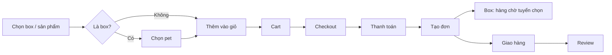
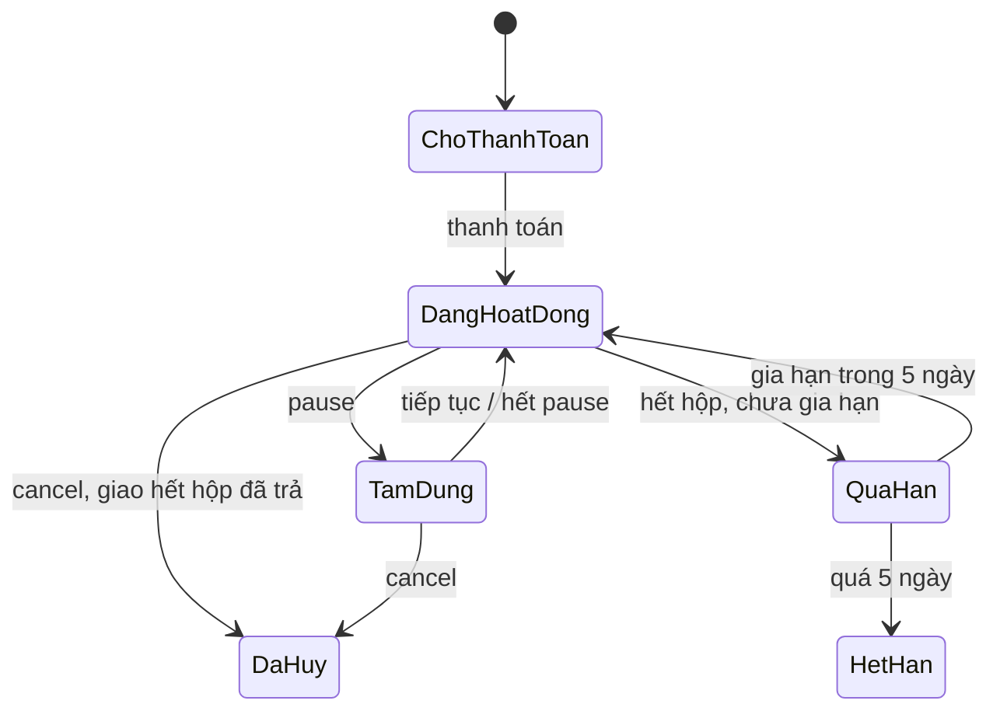

# FPETS – Đề xuất tính năng & luồng hoạt động

## 1. Tổng quan

FPETS bán Mystery Box cho chó và mèo: mỗi hộp gồm đồ ăn, đồ chơi, phụ kiện được chọn riêng theo hồ sơ của từng bé, mua thử 1 hộp hoặc đăng ký nhận định kỳ hằng tháng. Ngoài box, web bán lẻ food, toy, accessory như một pet shop bình thường.

**Mục tiêu của website**

- Khách hiểu FPETS bán gì trong 5–10 giây đầu ở trang chủ.
- Khách mua thử 1 hộp mà không phải cam kết dài hạn.
- Khách tạo Pet Profile để FPETS dùng thông tin đó tuyển chọn hộp.
- Khách đăng ký subscription, tạm dừng (pause) hoặc hủy (cancel) dễ dàng.
- Khách xem lịch sử đơn và trạng thái giao hàng.
- Admin quản lý sản phẩm, box, đơn hàng, khách hàng, thú cưng, subscription, tồn kho, voucher, review.

**Nguyên tắc thiết kế cho người dùng Việt Nam**

- Ưu tiên mobile: phần lớn khách mua qua điện thoại, mọi luồng phải thao tác được bằng một tay.
- Thanh toán quen thuộc: ví MoMo, VNPay QR, chuyển khoản; COD cho đơn mua 1 lần.
- Không tự động trừ tiền: người Việt ngại bị trừ tiền bất ngờ, nên subscription trả trước theo gói và nhắc gia hạn chủ động.
- Nhắc qua kênh khách thực sự đọc: email + thông báo trên web, giai đoạn 2 thêm Zalo.
- Ít bước: mua 1 lần tối đa 3 màn hình từ giỏ đến thanh toán; không bắt đăng ký trước khi xem sản phẩm.

## 2. Sơ đồ trang

Website gồm 3 nhóm trang cho khách và 5 nhóm module cho admin; Order Tracking và Review nằm trong My Account thay vì là trang riêng trên menu.

**Customer Website**

| Nhóm | Trang | Ghi chú |
| --- | --- | --- |
| Giới thiệu | Trang chủ | Hero, cách hoạt động, bảng giá, review |
| Giới thiệu | Mystery Box | Các loại box và gói subscription |
| Giới thiệu | Shop | Food, toy, accessory bán lẻ, có bộ lọc theo loài/size |
| Giới thiệu | Chi tiết sản phẩm / box | Ảnh, mô tả, review |
| Giới thiệu | FAQ / Về chúng tôi / Liên hệ | Liên hệ có nút Zalo, Messenger, hotline |
| Mua hàng | Pet Quiz | Điểm vào chính cho người mới |
| Mua hàng | Cart | Chỉ chứa hàng mua 1 lần |
| Mua hàng | Checkout | Mua 1 lần hoặc đăng ký gói |
| Mua hàng | Kết quả thanh toán | Thành công / thất bại, mã đơn |
| Mua hàng | Tra cứu đơn | Cho khách không đăng nhập: mã đơn + SĐT |
| My Account | Thông tin & sổ địa chỉ |  |
| My Account | Thú cưng của tôi | Danh sách Pet Profile |
| My Account | Đơn hàng | Lịch sử, chi tiết, tracking |
| My Account | Gói định kỳ | Xem, pause, cancel, gia hạn |
| My Account | Review & voucher của tôi |  |

**Admin Dashboard**

| Nhóm | Module |
| --- | --- |
| Tổng quan | Dashboard & thống kê |
| Vận hành | Đơn hàng · Hàng chờ tuyển chọn box · Subscription |
| Sản phẩm | Sản phẩm lẻ · Loại Mystery Box · Tồn kho |
| Khách hàng | Khách hàng · Pet Profile · Review |
| Hệ thống | Voucher · Tài khoản nhân viên & phân quyền |

## 3. Mystery Box, Pet Profile và tuyển chọn hộp

Mỗi hộp gắn với một Pet Profile; món cụ thể do admin chọn sát ngày giao, dựa trên hồ sơ, các món đã gửi và feedback của bé.

**Loại box (đề xuất, giá có thể chỉnh)**

| Loại | Dành cho | Số món | Giá trị hàng tối thiểu | Giá bán |
| --- | --- | --- | --- | --- |
| Box Tiêu chuẩn | Chó nhỏ, chó lớn, mèo (3 phiên bản) | 4–5 | 380.000₫ | 299.000₫ |
| Box Premium | Chó nhỏ, chó lớn, mèo (3 phiên bản) | 6–7 | 650.000₫ | 499.000₫ |

Mỗi hộp có ít nhất 1 món ăn (pate/snack/hạt gói nhỏ), 1 đồ chơi và 1 phụ kiện hoặc đồ vệ sinh. Giai đoạn đầu chỉ phục vụ chó và mèo.

**Pet Profile**

- Bắt buộc: tên bé, loài (chó/mèo), cân nặng hoặc size (nhỏ < 10 kg / lớn ≥ 10 kg), độ tuổi (dưới 1 tuổi / trưởng thành / trên 7 tuổi).
- Tùy chọn: giống, giới tính, ngày sinh (để tặng quà sinh nhật), ảnh, thành phần dị ứng hoặc cần tránh, sở thích (gặm, đồ chơi có tiếng, đồ chơi vận động…).
- Một tài khoản có nhiều pet; khách sửa profile bất kỳ lúc nào, hộp chưa chốt sẽ dùng thông tin mới.

**Pet Quiz cho khách mới**

1. Khách trả lời 5 câu ở trang Quiz, không cần đăng nhập.
2. Hệ thống gợi ý loại box phù hợp và hiện giá.
3. Khi bấm mua, khách đăng nhập hoặc đăng ký nhanh (SĐT/email hoặc Google); câu trả lời quiz tự lưu thành Pet Profile.

**Tuyển chọn hộp (phía admin)**

1. Đơn box mới hoặc kỳ giao mới vào "Hàng chờ tuyển chọn".
2. Hệ thống tự đề xuất danh sách món: lọc theo loài, size, tuổi; loại bỏ thành phần dị ứng, món đã gửi cho bé và món bé chấm "không thích"; chỉ lấy hàng còn trong kho.
3. Admin duyệt hoặc đổi món, hệ thống cảnh báo nếu tổng giá trị dưới mức tối thiểu.
4. Admin xác nhận: trừ tồn kho, đơn chuyển sang "Đang chuẩn bị".

## 4. Mua 1 lần: Cart và Checkout

Mua 1 lần đi qua giỏ hàng; box và sản phẩm lẻ được mua chung một giỏ, còn gói định kỳ có checkout riêng (mục 5).

Sản phẩm lẻ cho phép mua không cần tài khoản; giỏ có box thì bắt buộc đăng nhập để gắn Pet Profile.

**Cart: mỗi dòng sản phẩm**

- Ảnh, tên, phân loại (size/vị/màu nếu có).
- Với box: tên pet được gắn, đổi pet ngay trong giỏ.
- Đơn giá, nút − / + số lượng (không vượt tồn kho, tối đa 10), thành tiền, nút xóa.
- Cảnh báo "Chỉ còn X sản phẩm" hoặc "Hết hàng" (không cho thanh toán dòng hết hàng).

**Cart: tóm tắt đơn**

- Tạm tính, ô nhập voucher (hiện số tiền giảm hoặc lý do không hợp lệ).
- Phí ship ước tính và dòng "Mua thêm X₫ để được freeship".
- Tổng thanh toán, nút "Thanh toán".
- Giỏ rỗng: gợi ý box và sản phẩm bán chạy. Cuối giỏ có banner "Đăng ký gói để tiết kiệm đến 15%".
- Giỏ lưu theo tài khoản; khách chưa đăng nhập vẫn giữ giỏ khi tải lại trang, đăng nhập thì gộp giỏ.

**Checkout (1 trang, chia 4 khối)**

1. Thông tin nhận hàng: chọn địa chỉ đã lưu hoặc nhập mới (họ tên, SĐT, tỉnh/thành, quận/huyện, phường/xã, số nhà), ghi chú.
2. Giao hàng: tiêu chuẩn, hiện phí và ngày dự kiến.
3. Thanh toán: MoMo, VNPay (QR/ATM/thẻ), COD.
4. Xem lại đơn và bấm "Đặt hàng".

Thanh toán thành công: trang kết quả với mã đơn và nút "Theo dõi đơn". Thất bại: nút thử lại; đơn giữ "Chờ thanh toán" 30 phút rồi tự hủy và trả tồn kho.

## 5. Subscription (gói định kỳ)

Khách trả trước một lần cho 1, 3 hoặc 6 hộp, nhận 1 hộp mỗi tháng; hệ thống không tự trừ tiền mà nhắc khách gia hạn khi sắp hết gói.

**Bảng gói (tính theo Box Tiêu chuẩn 299.000₫)**

| Gói | Số hộp | Giảm | Giá trả trước | Giá mỗi hộp | Quà thêm |
| --- | --- | --- | --- | --- | --- |
| Gói 1 | 1 | 0% | 299.000₫ | 299.000₫ | — |
| Gói 3 | 3 | 10% | 807.000₫ | 269.000₫ | Freeship cả gói |
| Gói 6 | 6 | 15% | 1.525.000₫ | 254.000₫ | Freeship + quà sinh nhật bé |

Box Premium áp dụng cùng tỉ lệ giảm. Gói định kỳ chỉ thanh toán online (MoMo/VNPay), không COD.

**Luồng đăng ký**

1. Chọn loại box và gói (1/3/6).
2. Chọn pet (hoặc tạo mới qua quiz).
3. Chọn đợt giao: đầu tháng (ngày 1–5) hoặc giữa tháng (ngày 15–20).
4. Nhập địa chỉ, áp voucher, thanh toán.
5. Gói chuyển "Đang hoạt động"; hệ thống tự tạo đơn box cho từng kỳ và đưa vào hàng chờ tuyển chọn.

**Ngày chốt (cut-off)**: 7 ngày trước đợt giao. Sau ngày chốt, mọi thay đổi (pause, cancel, đổi pet, đổi địa chỉ) áp dụng từ kỳ sau vì hộp kỳ này đã được chuẩn bị.

**Gia hạn**

- Khi còn 1 hộp cuối: nhắc gia hạn trước hạn 7 ngày, 3 ngày, 1 ngày (email + thông báo web).
- Khách bấm "Gia hạn", chọn lại gói (có thể đổi gói), thanh toán: gói nối tiếp, không gián đoạn.
- Không thanh toán: đến hạn chuyển "Quá hạn", giữ ưu đãi và lịch giao thêm 5 ngày.
- Hết 5 ngày vẫn chưa trả: chuyển "Hết hạn". Pet Profile và lịch sử vẫn giữ, khách đăng ký lại bất kỳ lúc nào.

**Pause và Cancel**

|  | Pause (tạm dừng) | Cancel (hủy) |
| --- | --- | --- |
| Tác dụng | Bỏ qua 1 hoặc 2 kỳ giao tiếp theo | Ngừng gói, không nhắc gia hạn nữa |
| Hộp đã trả trước | Giữ nguyên, dời sang các tháng sau | Vẫn giao hết các hộp đã trả, không hoàn tiền |
| Giới hạn | Tối đa 2 kỳ liên tiếp, hết hạn tự hoạt động lại | Hủy được bất kỳ lúc nào |
| Tiếp tục | Nút "Tiếp tục ngay" | Đăng ký gói mới |
| Khi bấm | Xác nhận 1 bước | Hỏi lý do hủy, gợi ý "Tạm dừng thay vì hủy?" |

**Trạng thái gói**

Tên trạng thái: Chờ thanh toán, Đang hoạt động, Tạm dừng, Quá hạn, Hết hạn, Đã hủy.

## 6. Thanh toán và giao hàng

Dùng MoMo và VNPay cho thanh toán online, COD cho đơn mua 1 lần; giao toàn quốc qua một đơn vị vận chuyển có API (đề xuất GHN).

**Thanh toán**

| Phương thức | Mua 1 lần | Gói định kỳ | Ghi chú |
| --- | --- | --- | --- |
| Ví MoMo | Có | Có |  |
| VNPay (QR ngân hàng, thẻ ATM, Visa/Master) | Có | Có |  |
| COD | Có, đơn dưới 2.000.000₫ | Không | Admin gọi xác nhận đơn COD đầu tiên của khách |

Giai đoạn làm web chạy trên môi trường sandbox; khách cần tài khoản merchant MoMo/VNPay trước khi mở bán thật.

**Giao hàng**

- Phạm vi: toàn quốc.
- Phí ship: đồng giá 25.000₫ nội thành TP.HCM, 35.000₫ tỉnh khác (giai đoạn 1); giai đoạn 2 lấy phí thật từ API GHN.
- Freeship cho đơn từ 500.000₫ và cho gói 3, gói 6.
- Thời gian dự kiến: 1–2 ngày nội thành, 3–5 ngày tỉnh khác, hiển thị ở checkout.

## 7. Trạng thái đơn hàng và tracking

Mọi đơn (mua 1 lần hoặc từng kỳ của gói) đi qua 7 trạng thái dưới đây; khách xem timeline kèm giờ cập nhật trong My Account hoặc trang tra cứu đơn.

| Trạng thái | Ý nghĩa | Khách được hủy? |
| --- | --- | --- |
| Chờ thanh toán | Đã tạo đơn, chưa trả tiền online (tự hủy sau 30 phút) | Có |
| Đã xác nhận | Đã thanh toán, hoặc đơn COD đã được xác nhận | Có |
| Đang chuẩn bị | Box đang được tuyển chọn / đóng gói | Không |
| Đang giao | Đã bàn giao vận chuyển, có mã vận đơn | Không |
| Đã giao | Khách đã nhận, mở quyền review | Không |
| Đã hủy | Khách hoặc admin hủy, hoàn tiền nếu đã trả | — |
| Đổi / Trả | Đang xử lý theo chính sách mục 10 | — |

Đơn thuộc gói định kỳ có nhãn "Kỳ 2/6" và link về gói. Giai đoạn 1 admin cập nhật trạng thái và mã vận đơn thủ công; giai đoạn 2 đồng bộ tự động từ GHN.

## 8. Review, voucher và thông báo

Review vừa để khách mới tin, vừa là dữ liệu để chọn hộp sau cho đúng bé; voucher và thông báo phục vụ bán hàng và giữ chân khách.

**Review / Feedback**

- Chỉ đơn "Đã giao" mới được review, trong vòng 30 ngày.
- Nội dung: 1–5 sao, nhận xét, tối đa 5 ảnh unbox.
- Với box: khách chấm từng món "Bé thích / Bình thường / Không thích"; dữ liệu lưu vào Pet Profile để tuyển chọn kỳ sau.
- Review hiện ngay, admin có quyền ẩn và phản hồi. Review có ảnh được tặng voucher 20.000₫ cho đơn sau.

**Voucher**

- Loại: giảm %, giảm số tiền cố định, freeship.
- Điều kiện: đơn tối thiểu, số lượt dùng (tổng và mỗi khách), thời hạn, phạm vi (hàng lẻ / box / gói định kỳ lần đầu).
- Mặc định có sẵn: mã chào mừng giảm 10% cho đơn đầu tiên.
- Mỗi đơn dùng 1 voucher; voucher không cộng dồn với giảm giá của gói 3/6.

**Thông báo**

| Sự kiện | Email | Trên web |
| --- | --- | --- |
| Đặt hàng / thanh toán thành công | Có | Có |
| Đơn đổi trạng thái (đang giao, đã giao) | Có | Có |
| Box sắp được giao (3 ngày trước) | Có | Có |
| Nhắc gia hạn gói (7, 3, 1 ngày trước) | Có | Có |
| Gói quá hạn / hết hạn | Có | Có |
| Mời review sau khi giao 2 ngày | Có | Có |

Giai đoạn 2 thêm Zalo OA cho nhắc gia hạn và trạng thái đơn, vì khách Việt đọc Zalo nhiều hơn email.

## 9. Admin Dashboard

Admin có 11 module; "Hàng chờ tuyển chọn box" là module mới cần thêm so với yêu cầu ban đầu, vì đây là nơi tạo ra hộp cho từng bé.

| Module | Chức năng chính |
| --- | --- |
| Dashboard & thống kê | Doanh thu ngày/tháng; đơn theo trạng thái; số gói đang hoạt động, tạm dừng, hủy trong tháng; tỉ lệ hủy và lý do; số hộp cần chuẩn bị 7 ngày tới; hàng sắp hết; top sản phẩm; xuất Excel |
| Đơn hàng | Lọc theo trạng thái, loại (lẻ / box / gói), ngày; xem chi tiết; cập nhật trạng thái, nhập mã vận đơn; xác nhận COD; hủy, hoàn tiền |
| Hàng chờ tuyển chọn box | Danh sách hộp cần chuẩn bị theo đợt giao; mỗi dòng hiện pet, loài, size, dị ứng, món đã gửi, feedback; đề xuất món tự động; admin duyệt/đổi; cảnh báo dị ứng, trùng món, thiếu giá trị |
| Subscription | Danh sách gói, kỳ hiện tại / tổng kỳ, ngày giao kế tiếp, ngày hết hạn; lịch sử các kỳ; pause, cancel, gia hạn hộ khách |
| Sản phẩm lẻ | Thêm/sửa/ẩn; danh mục food/toy/accessory; thuộc tính loài, size, độ tuổi, thành phần; giá, ảnh; đánh dấu "bán lẻ" và/hoặc "dùng cho box" |
| Loại Mystery Box | Tên, loài, size, số món, giá trị tối thiểu, giá bán, ảnh; cấu hình tỉ lệ giảm gói 3/6 |
| Tồn kho | Số lượng hiện có; phiếu nhập; lịch sử xuất (bán lẻ / dùng cho box); ngưỡng cảnh báo |
| Khách hàng | Thông tin, địa chỉ, đơn, gói, pet; khóa tài khoản |
| Pet Profile | Xem, sửa hộ khách; lịch sử hộp đã nhận và feedback từng món |
| Review | Ẩn/hiện, phản hồi, lọc theo sao |
| Voucher | Tạo, sửa, tắt mã; xem số lượt đã dùng |

**Phân quyền**

| Vai trò | Được dùng |
| --- | --- |
| Quản trị (chủ shop) | Tất cả, gồm tài khoản nhân viên và thống kê doanh thu |
| Nhân viên kho | Hàng chờ tuyển chọn, tồn kho, sản phẩm, cập nhật trạng thái đơn |
| Nhân viên CSKH | Đơn hàng, khách hàng, pet, subscription, review, voucher |

## 10. Chính sách đổi trả

Mystery Box không đổi trả vì "không thích", nhưng FPETS đổi món miễn phí khi lỗi thuộc về shop; khách báo trong 3 ngày sau khi nhận, kèm ảnh hoặc video mở hộp.

| Trường hợp | Xử lý |
| --- | --- |
| Món chứa thành phần dị ứng đã khai trong Pet Profile | Đổi món miễn phí hoặc hoàn tiền món đó |
| Hàng hỏng, vỡ, hết hạn sử dụng | Đổi món miễn phí |
| Giao thiếu món | Gửi bù miễn phí |
| Bé không thích món | Không đổi; ghi nhận feedback để hộp sau tránh |
| Sản phẩm lẻ còn nguyên seal | Đổi trả trong 7 ngày, khách chịu phí ship |

Khách gửi yêu cầu từ trang chi tiết đơn (nút "Yêu cầu đổi / trả"), đơn chuyển sang trạng thái Đổi / Trả để CSKH xử lý.

## 11. Phạm vi triển khai và điểm cần xác nhận

Đề xuất làm 2 giai đoạn: giai đoạn 1 đủ để bán thật và demo toàn bộ luồng, giai đoạn 2 thêm tự động hóa.

| Giai đoạn | Nội dung |
| --- | --- |
| 1 – Bắt buộc | Toàn bộ trang khách (mục 2); Pet Quiz & Pet Profile; mua 1 lần; gói 1/3/6 với pause, cancel, gia hạn; MoMo, VNPay sandbox, COD; phí ship đồng giá; trạng thái đơn cập nhật thủ công; review chấm từng món; voucher; thông báo email + web; toàn bộ admin gồm hàng chờ tuyển chọn |
| 2 – Mở rộng | Phí ship và tracking tự động qua API GHN; thông báo Zalo OA; quà sinh nhật tự động; chương trình giới thiệu bạn bè |

**Các điểm khách cần xác nhận**

- [ ] Mô hình gói: trả trước 1/3/6 hộp, không tự động trừ tiền, không hoàn tiền khi hủy (mục 5).
- [ ] Loại box, số món và giá bán đề xuất (mục 3, 5).
- [ ] Cổng thanh toán MoMo + VNPay + COD; khách đã có hoặc sẽ đăng ký tài khoản merchant (mục 6).
- [ ] Phạm vi giao toàn quốc, phí ship và mức freeship (mục 6).
- [ ] Chính sách đổi trả (mục 10).
- [ ] Logo, màu thương hiệu, ảnh sản phẩm/box; website tham khảo nếu có.
- [ ] Deadline và các mốc demo.
